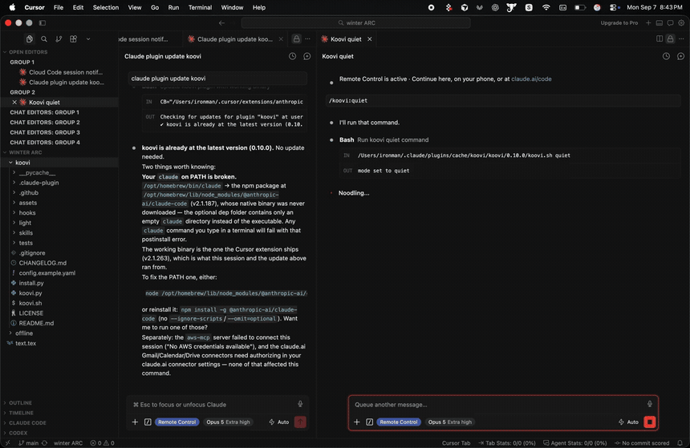

<p align="center">
  
</p>

<h1 align="center">Koovi</h1>

<p align="center">
  <a href="https://github.com/tjmode/koovi/actions/workflows/ci.yml"></a>
  <a href="CHANGELOG.md"></a>
  <a href="LICENSE"></a>
  
  
</p>

**Koovi tells you which of your coding sessions just finished or needs an answer.** Work in one
window while three others run.

```
"Checkout is done."
"Payments asks: Postgres or SQLite?"
```

One line, one reminder if you do not reply, then silence. Your next message in that window is the
answer. [Hear it](assets/koovi-voice.mp4) — ten seconds, turn the sound on.

## Install

**Claude Code** (one line at a time)

```
/plugin marketplace add tjmode/koovi
```
```
/plugin install koovi@koovi
```

Or the same two from a terminal, which also works where `/plugin` is not available:

```sh
claude plugin marketplace add tjmode/koovi
claude plugin install koovi@koovi
```

**Codex, Cursor, OpenCode, or without the plugin system**

```sh
git clone https://github.com/tjmode/koovi.git
cd koovi && python3 install.py
```

Needs Python 3.8 or newer, nothing else.

**Update** (then restart Claude Code; your settings survive)

```sh
claude plugin update koovi
```

> [!IMPORTANT]
> Koovi speaks on the machine that runs the session. Install it on the computer you sit at, not in
> a cloud or web session, where nobody can hear it.

## Commands

Type `/koovi:` in Claude Code and they all appear. The same words work after `./koovi.sh`.

| Command | What it does |
| :--- | :--- |
| `/koovi:status` | how it is set, and the last few decisions |
| `/koovi:dashboard` | activity and interruption summary across your sessions |
| `/koovi:log` | why it spoke, or why it stayed quiet |
| `/koovi:doctor` | check every part, and name what is missing |
| `/koovi:quiet` | stop talking, flash the screen instead |
| `/koovi:voice` | talk again, or add a name to switch voice |
| `/koovi:mute` | silence this project, `/koovi:unmute` to undo |
| `/koovi:test` | hear a sample line |
| `/koovi:set` | change one setting |
| `/koovi:koovi` | anything else: `dashboard`, `notify`, `auto`, `light`, `voices`, `mic`, `version` |

Nothing about the voice is fixed:

```sh
/koovi:set assistant Jarvis      # what it calls itself
/koovi:set user boss             # what it calls you
/koovi:voice Daniel              # which voice speaks
/koovi:set rate 190              # how fast
```

## When it stays quiet

- Turns under 5 seconds, so your "ok" replies never trigger it.
- Replies that ran no tools, unless they took over two minutes.
- The same window twice inside 20 seconds, muted projects, and your quiet hours.
- After one reminder. Finished work is announced once and never nagged.
- While your microphone is in use. It even stops mid-word if you start dictating.
- While you are on that window already. If you still have not typed anything two minutes
  later, it says it once then, and that is the whole of it.

Permission requests are the exception and are spoken at once: you answer those by clicking,
and nothing tells Koovi that you did.

> [!TIP]
> In an office? `/koovi:quiet` swaps the voice for a coloured frame that flashes around your
> screens for five seconds with the session named in the corner. `/koovi:koovi auto` picks by
> whether headphones are plugged in.

<p align="center">
  
</p>

## Good to know

- Everything is in `~/.koovi/config.yaml`, explained line by line inside
  [`config.example.yaml`](config.example.yaml): the sentences it says, per-project names, timings.
- It reads the end of the session transcript, writes only to `~/.koovi`, and has no network code.
  Nothing leaves your machine. `/koovi:log` shows every decision it ever made.
- macOS is in daily use. Windows and Linux are written but untested, and `/koovi:doctor` says what
  a machine is missing. Reports from either are the most useful thing you can send.
- Remove it with `/plugin uninstall koovi`, or `python3 install.py --uninstall`.

## Talk to me

Questions, ideas, or just to say it worked: [Discord](https://discord.gg/YJfCBZ3sex). For anything
broken, run `/koovi:doctor` and [open an issue](https://github.com/tjmode/koovi/issues) with what
it said.

---

MIT licensed · [Changelog](CHANGELOG.md) · tests: `python3 -m unittest discover -s tests`
